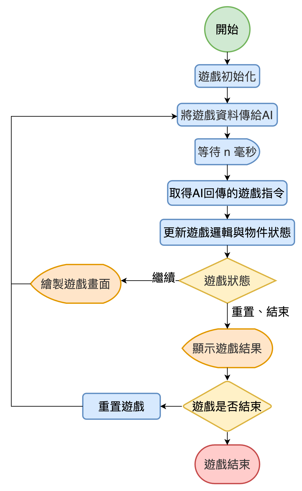
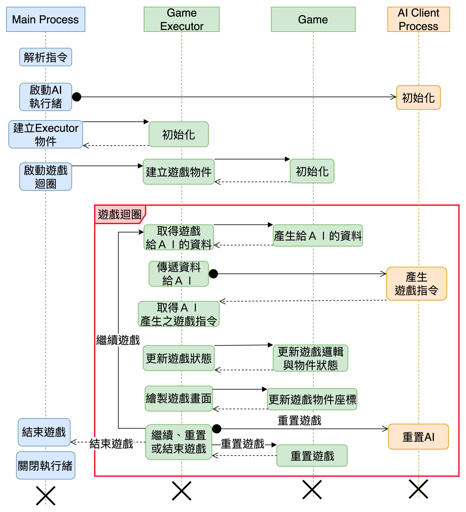

# 系統架構
此框架為連接遊戲、遊戲顯示器、遊戲ＡＩ的框架，因此會運行 multi process。本文件會先說明遊戲系統的流程，再細講遊戲、ＡＩ等元件。
# 遊戲運作流程圖
遊戲啟動，執行流程如圖所示，n  = `1/FPS` 秒，因此每個AI可以計算的時間，最長就是 `1/FPS` 秒。

# 系統時序圖 
主執行緒在啟動ＡＩ執行緒之後，會初始化遊戲物件，並啟動遊戲，執行緒的運作如圖，起點為左上之Main Process，依序往下執行。
遊戲開發者可自行開發遊戲，但須繼承 `PaiaGame`，並且實作多個函式，每個函式都有各自的用途。
遊戲AI開發者則須建立一個MLPlay()的class，並在update()中，回傳遊戲指令。
MLGame（主程序,main process,以下簡稱MLGame）是遊戲與ＡＩ的橋梁，負責傳遞訊息與管理各個程序，會依序呼叫 PaiaGame 和 AI的各個函式，呼叫順序可以參考下方時序圖。

AI程式會運行於另外一個process，透過一組pipe跟MLGame交換資料與遊戲指令，因此MLGame使用非同步呼叫的方式呼叫MLPlay中的函式。
若是AI計算時間過長，來不及回傳遊戲指令，則是會被忽視，同時系統會輸出 `delay` 字樣

