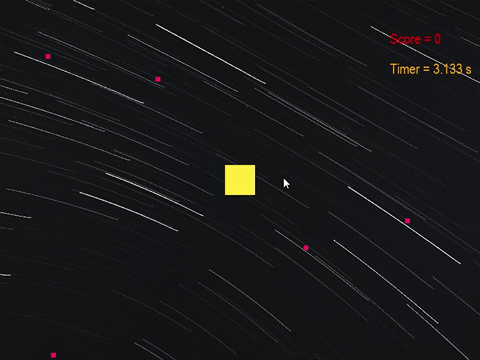

# Easy Game
這是一個簡單的遊戲，主要用來示範如何在PAIA 上發布一個遊戲

## Game Config
遊戲參數定義檔案需要使用json格式，且需要命名為`game_config.json`
```json
{
  "game_name": "easy_game", // 遊戲的名稱
  "version": "1.0.1", // 版本號
  "url": "None", // github 專案連結
  "game_params": [ // 遊戲參數陣列
    {
      "name": "time_to_play", // 遊戲參數的名字
      "verbose": "遊戲總幀數", // 顯示文字
      "type": "int", // 類型 分為 int str
      "max": 2000, // int 可以設定 最大最小值
      "min": 600,
      "default": 600, // 遊戲參數的預設值
//     參數的輔助說明
      "help": "set the limit of frame count , actually time will be revised according to your FPS .",
      
    },
    {
      "name": "color",
      "verbose": "矩形顏色",
      "type": "str",
      "choices": [
//        字串的選項需要有顯示文字(verbose) 與 實際值(value)
        {
          "verbose": "CYAN",
          "value": "00BCD4"
        },
        {
          "verbose": "YELLOW",
          "value": "FFEB3B"
        },
        {
          "verbose": "ORANGE",
          "value": "FF9800"
        }
      ],
      "help": "set the color of rectangle",
      "default": "FFEB3B"
    }
  ]
}
```
## Game Blockly
```json
{
    "GAME_STATUS": [
//      遊戲狀態的參數
//      ['python 變數名稱','display in English','中文的顯示文字']
        ["GAME_ALIVE", "alive", "存活"],
        ["GAME_PASS", "pass", "通關"],
        ["GAME_OVER", "over", "失敗"]
    ],
    "SCENE_INFO": [
//      傳給MLPlay的資料內容
//      ["python code", "english", "chinese"],
        ["scene_info['frame']", "# frame", "# 幀數"],
        ["scene_info['status']", "game status", "遊戲狀態"],
        ["scene_info['ball_x']", "x coordinate of ball", "球的 x 座標"],
        ["scene_info['ball_y']", "y coordinate of ball", "球的 y 座標"],
        ["scene_info['score']", "x coordinate of platform", "平台的 x 座標"],
        ["scene_info['foods']", "list of foods positions", "點點的位置清單"],
        ["scene_info", "dictionary of all information", "包含所有資訊的字典"]
    ],
    "CONSTANT": [
//      提供給玩家的常數資訊
//      ["value", "english", "chinese"],
        [0, "left boundary", "左邊界"],
        [800, "right boundary", "右邊界"],
        [0, "top boundary", "上邊界"],
        [600, "bottom boundary", "下邊界"],
        [50, "ball width", "球身的寬度"],
        [50, "ball height", "球身的高度"],
        [8, "food width", "食物的寬度"],
        [8, "food height", "食物的高度"]
    ],
    "ACTION": [
//      讓玩家使用的遊戲指令
//      ["python code", "english", "chinese"],
        ["UP", "moving up", "向上移動"],
        ["DOWN", "moving down", "向下移動"],
        ["LEFT", "moving left", "向左移動"],
        ["RIGHT", "moving right", "向右移動"],
        ["NONE", "doing nothing", "不動作"]

    ]
}
```
## Game interface
遊戲需要實作一個interface
```python

class PaiaGame(abc.ABC):

    def __init__(self):
        """
        初始化資料
        """
        pass

    @abc.abstractmethod
    def update(self, commands):
        self.frame_count += 1

    @abc.abstractmethod
    def game_to_player_data(self) -> dict:
        """
        send something to game AI
        we could send different data to different ai
        """
        to_players_data = {}
        
        return to_players_data

    @abc.abstractmethod
    def reset(self):
        pass

    @abc.abstractmethod
    def get_scene_init_data(self) -> dict:
        """
        Get the initial scene and object information for drawing on the web
        """
        # TODO add music or sound
        scene_init_data = {"scene": self.scene.__dict__,
                           "assets": [

                           ],
                           # "audios": {}
                           }
        return scene_init_data

    @abc.abstractmethod
    def get_scene_progress_data(self) -> dict:
        """
        Get the position of game objects for drawing on the web
        """

        scene_progress = {
            # background view data will be draw first
            "background": [],
            # game object view data will be draw on screen by order , and it could be shifted by WASD
            "object_list": [],
            "toggle": [],
            "foreground": [],
            # other information to display on web
            "user_info": [],
            # other information to display on web
            "game_sys_info": {}
        }
        return scene_progress

    @abc.abstractmethod
    def get_game_result(self) -> dict:
        """
        send game result
        """
        return {"frame_used": self.frame_count,
                "result": {

                },

                }

    @abc.abstractmethod
    def get_keyboard_command(self) -> dict:
        """
        Define how your game will run by your keyboard
        """
        cmd_1p = []

        ai_1p = self.ai_clients()[0]["name"]
        return {ai_1p: cmd_1p}

    @staticmethod
    def ai_clients() -> list:
        """
        let MLGame know how to parse your ai,
        you can also use this names to get different cmd and send different data to each ai client
        """
        return [
            {"name": "1P"}
        ]

```

## Flowchart

